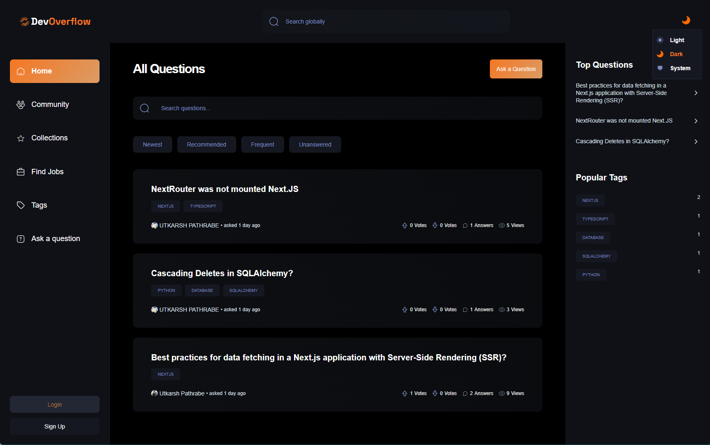
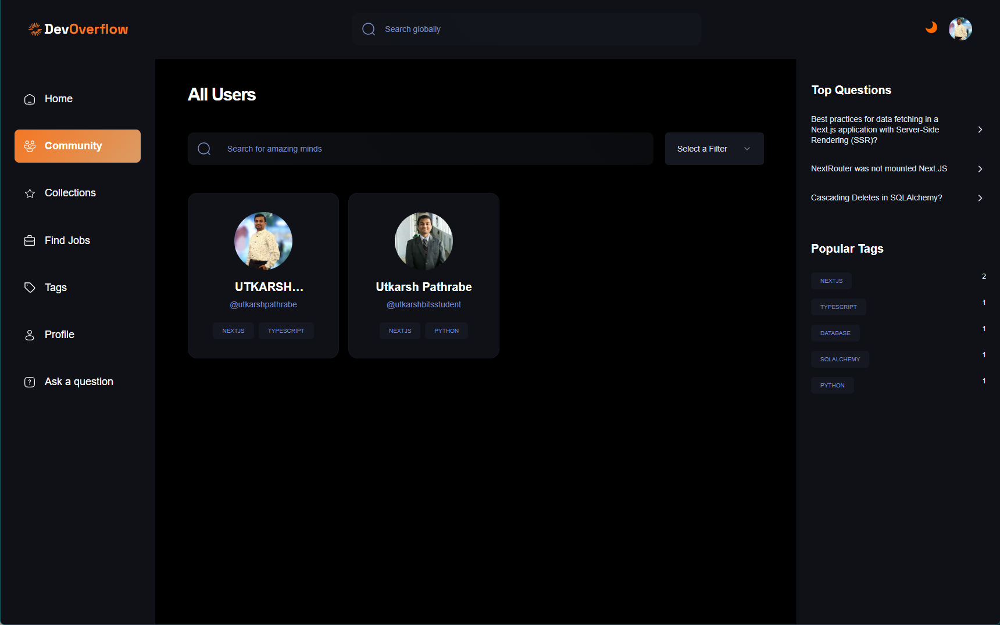
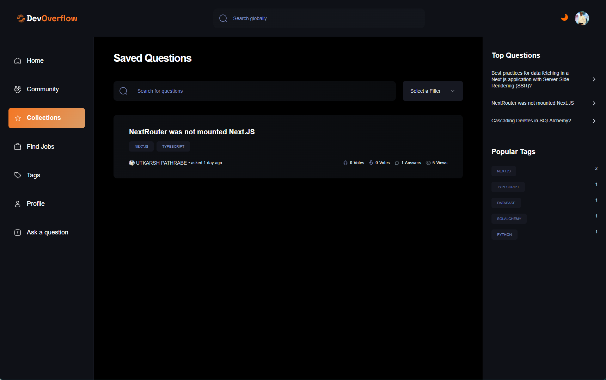
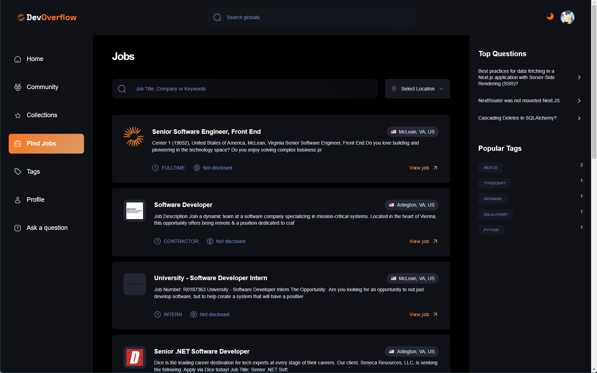
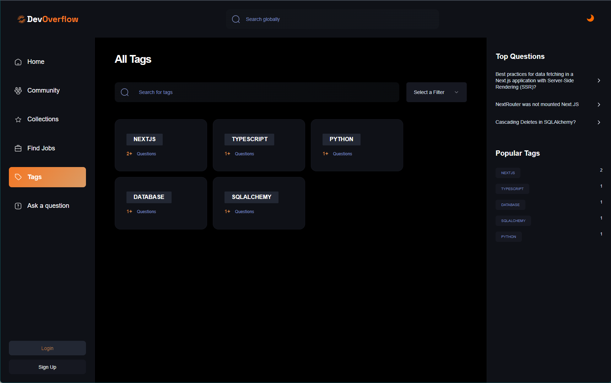
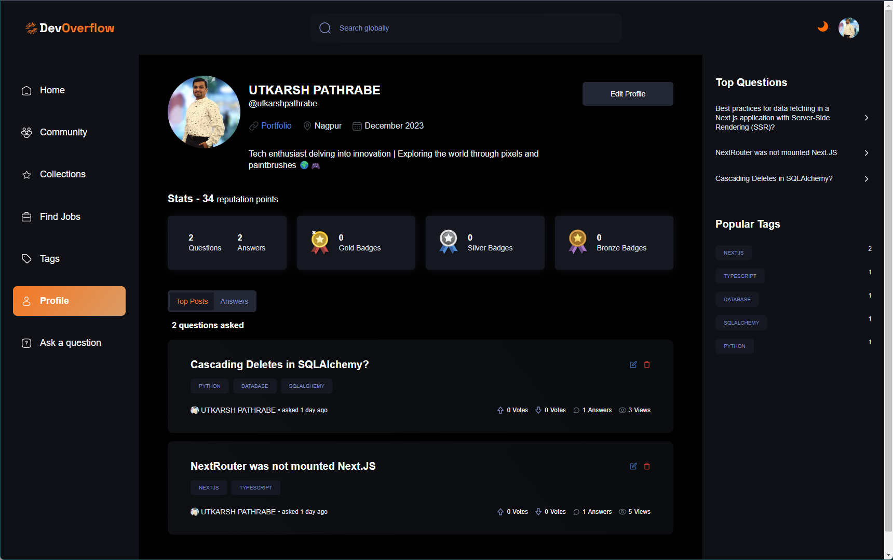
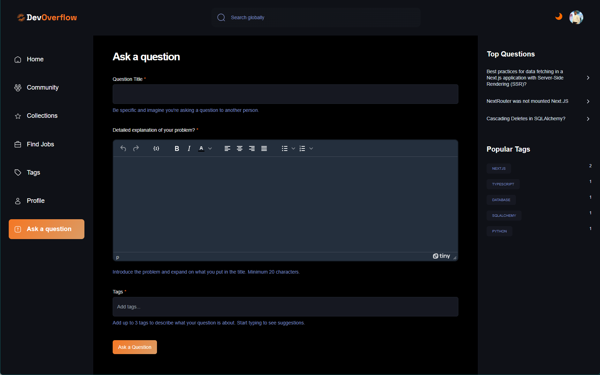
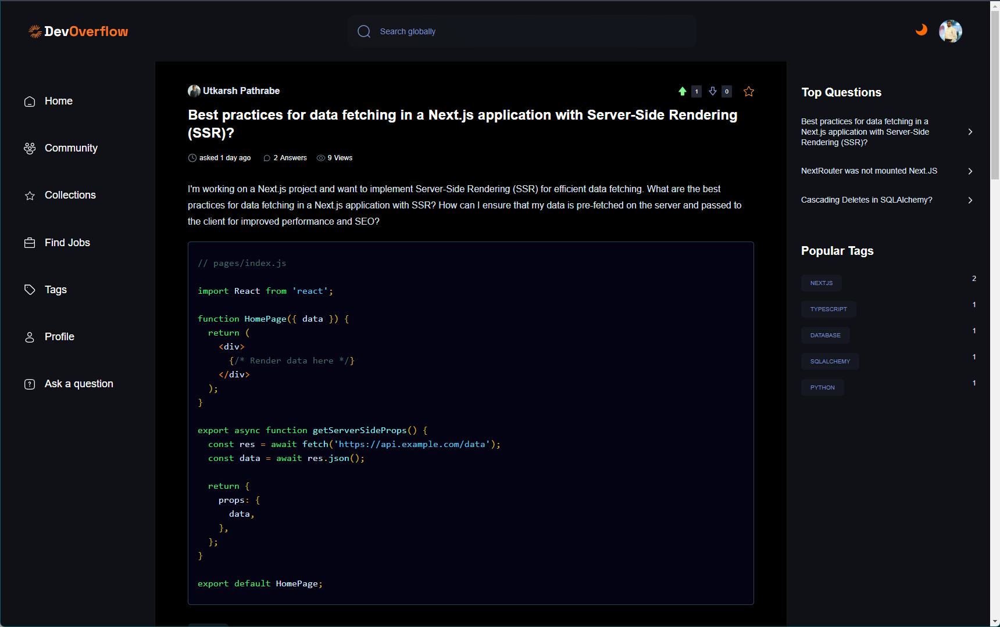

# Dev Overflow - StackOverflow Clone

Welcome to Dev Overflow - a comprehensive StackOverflow-like platform created as part of the "Ultimate Next.js 14 Course" by JS Mastery. This app is built with Next.js, utilizing cutting-edge web development techniques to provide a feature-rich experience.

## Features:

### Cutting-edge Web Development:

- **Next.js Mastery**: Mastered the Next.js framework, exploring routing, authentication, and real-time events.
- **UI/UX Optimization**: Extensive focus on user interface and user experience for seamless navigation.
- **Form Handling**: Efficient form handling using react-hook-form and zod for validation.
- **Open AI Integration**: Leveraged Open AI for generating automated answers.
- **SEO Optimization**: Implemented SEO best practices for better visibility.

## Advanced Functionality:

- **Recommendation System**: Unique system for recommending posts.
- **Global Database Data Fetching**: Effortlessly retrieve global database information.
- **AI-Generated Answers**: Innovative feature providing AI-generated answers to questions.
- **Badge & Reputation System**: Recognition system for user contributions.
- **Views and Voting Mechanism**: Engaging user interaction features.
- **Filter and Pagination**: Enhanced search capabilities for a seamless experience.

## Contents:

This repository contains the source code and related files for the Dev Overflow app. The app is deployed and accessible at [Dev Overflow](https://utkarsh-dev-overflow.vercel.app/).

## Technologies Used:

- **NMongoDB**: Document database for storing and managing app data.
- **ESLint**: JavaScript linting tool for code consistency and error checking.
- **ReactJS**: JavaScript library for building interactive UIs.
- **Mongoose**: Object Data Modeling (ODM) library for MongoDB and Node.js.
- **Next.js**: React framework for server-side rendering and routing.
- **Prettier**: Code formatter for ensuring consistent code style.
- **RapidAPI**: Platform for accessing external APIs.
- **Tailwind CSS**: Utility-first CSS framework for quick styling.
- **Zod**: TypeScript-first schema validation library for form handling.
- **React Hook Form**: React library for building forms with hooks.
- **Radix UI**: Design system for building accessible UI components.
- **ClerkAuth**: Authentication service for user authentication and management.
- **Shadcn UI**: UI library for creating interactive components and animations.
- **TypeScript**: Statically typed superset of JavaScript for enhanced code quality.

Explore the source code and delve into the world of modern web development with Dev Overflow!

### Home Page

### Community Page

### Collections Page

### Find Jobs Page

### Tags Page

### Profile Page

### Ask a Question Page

### Question Details Page

